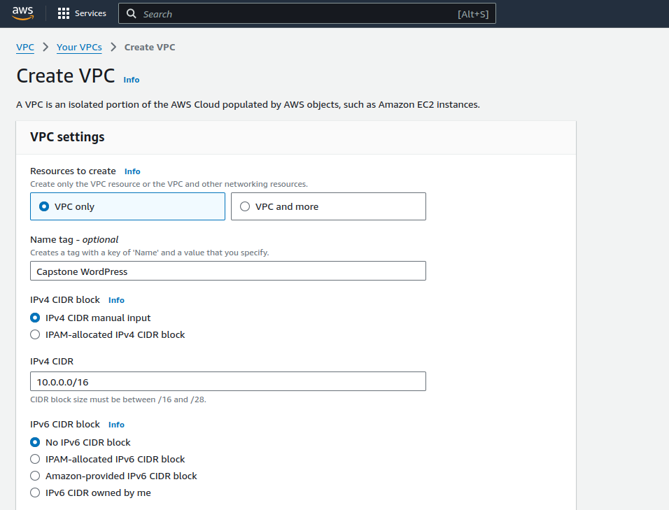
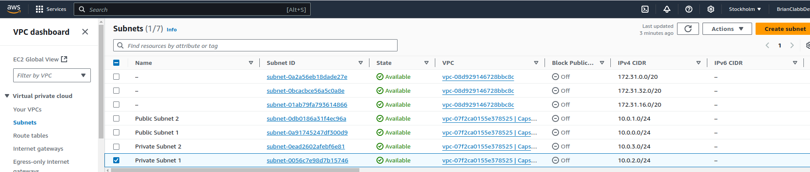
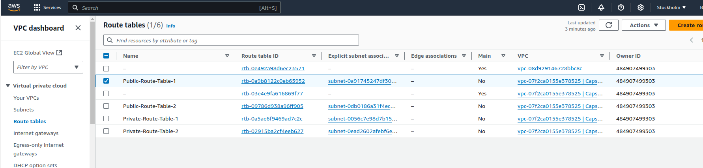
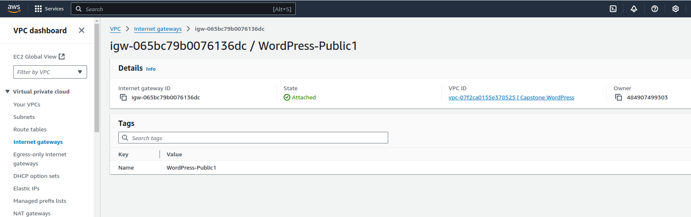
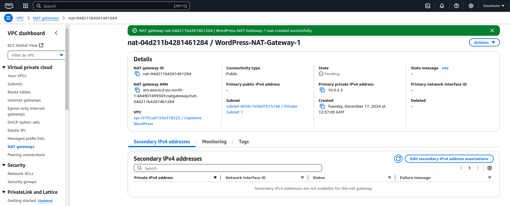
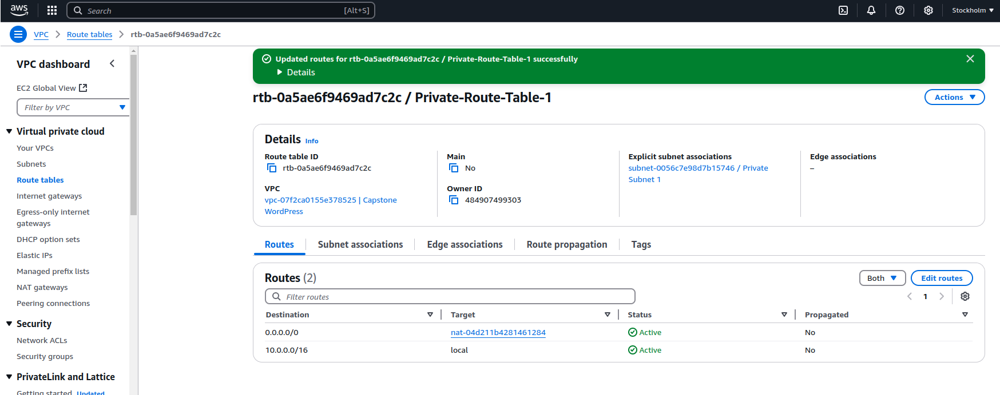

# Capstone-Wordpress Site on AWS
Capstone WordPress site on AWS

**Project**

In this project I will be enhancing the online Presence of a digital marketing agency called DigitalBoost. A WordPress based website for their clients.

<ins>Task1 a - Define IP address range for VPC</ins>

Please see following CIDR Block & Subnets

VPC CIDR block: 10.0.0.0/16

•	Public subnet 1: 10.0.0.0/24 (web servers)

•	Public subnet 2: 10.0.1.0/24 (load balancer)

•	Private subnet 1: 10.0.2.0/24 (database servers)

•	Private subnet 2: 10.0.3.0/24 (additional resources)

<ins>Task1 b - Create a VPC with public and private Subnet</ins>

Please see VPC in AWS Console

...additionally see created Public & Private Subnets

<ins>Task1 c - Configure route tables for each subnet </ins>

Now that the VPC and Subnets are created, I create Route Tables for both Public and Private subnets - please see route table, and subnet associations:

And because we have two Public Subnets and associated Route Tables-this is the Internet gateway:

<ins>Task2 a - Set up Public subnet for resources accessible from the internet</ins>
<ins>Task2 b - Set up Private subnet for resources with no direct internet access</ins>

You can see from Task 1b that we have already created the Public and Private subnets, with internet and local accessability respectively. Therefore we can move onto Natting - Step 2c.

<ins>Task2 c - Configure a NAT Gateway for private subnet internet access</ins>

What is a NAT gateway?

A NAT gateway is a managed service that translates the private IP addresses of your instances into a public IP address.
This allows your instances to connect to the internet, but prevents the internet from directly connecting to your instances.
This helps keep your instances secure.

We will now create a NAT Gateway for Private Subnet 1. 

Steps are as follows:

How to create a NAT gateway in AWS:

•	Create a public subnet: This is where your NAT gateway will reside - Public Subnet 1

•	Create an internet gateway: This is the gateway that connects your VPC to the internet. - This has been created - see above

•	Create a route table for your public subnet: This route table will tell your instances to use the internet gateway to reach the internet.- This has been created-see above

I have allocated the Primary Private IP address from Private Subnet 1 ( 10.0.2.0/24 ) - 10.0.2.5

See NAT gateway created

**Note As NAT Gateways are billed hourly-this will be deleted and recreated as this Project continues**

Finally, I have instructed Route-Table-1 to use the NAT gateway to reach the internet, This route will specify that all traffic destined for the internet (0.0.0.0/0) should be sent to the NAT gateway:

   

